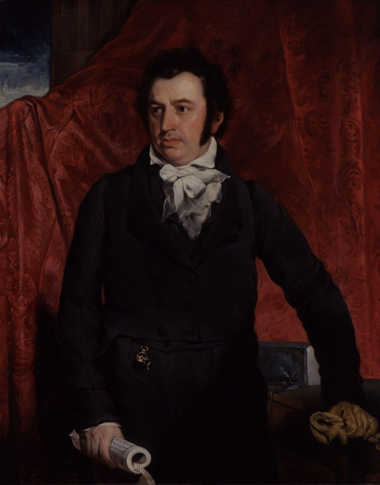

> 这不是课程正文。下面是一段按公开史实整理的短文，用来演示「点开能读一篇带图的短文」。正式教材请用课堂上的材料。

1807 年 9 月 7 日，马礼逊（Robert Morrison, 1782–1834）抵达广州，成为第一位来华的新教传教士。他受伦敦传道会（London Missionary Society）差遣，从英国出发，因东印度公司不愿搭载传教士，只好先取道美国，再乘船经澳门进入广州。

## 来华之路

马礼逊生于英格兰诺森伯兰，早年学习神学、医学与天文学，并在伦敦期间跟随一位广州来的青年学习中文。1807 年 1 月他在伦敦按立，1 月底启程赴美，5 月 12 日登上开往澳门的「三叉戟号」（Trident）。经过 113 天航行，他于 9 月 4 日抵达澳门，数日后进入广州城外十三行区。由于清廷禁止外国人学习中文、也禁止传教，他只能以外贸翻译和研习语言的身份留下，同时秘密进行文字工作。

## 译经与字典

马礼逊最重要的工作是翻译《圣经》和编纂汉英字典。1812 年他完成《中文文法》，1814 年译完《使徒行传》，随后又译出《路加福音》。1815 年起，他着手编纂《华英字典》（*A Dictionary of the Chinese Language*），至 1823 年出齐三卷六册，成为近代第一部大型汉英—英汉字典。同年，他与同工米怜（William Milne）合作翻译的中文《圣经》在马六甲印刷完成，史称「马礼逊译本」。

## 影响与去世

马礼逊在华 27 年，只回英国一次。他曾受聘于东印度公司担任翻译，也参与创办英华书院、设立澳门贫民药房等事工。他生前施洗的中国信徒不多，但为后来的圣经翻译、字典编纂和教育工作奠定了基础。1834 年 8 月 1 日，马礼逊在广州病逝，享年 52 岁，后安葬于澳门旧基督教坟场，紧邻他的第一位妻子和早夭的长子。

*本文内容整理自维基百科 [Robert Morrison (missionary)](https://en.wikipedia.org/wiki/Robert_Morrison_(missionary))，仅供结构演示，不是课程正文。*
